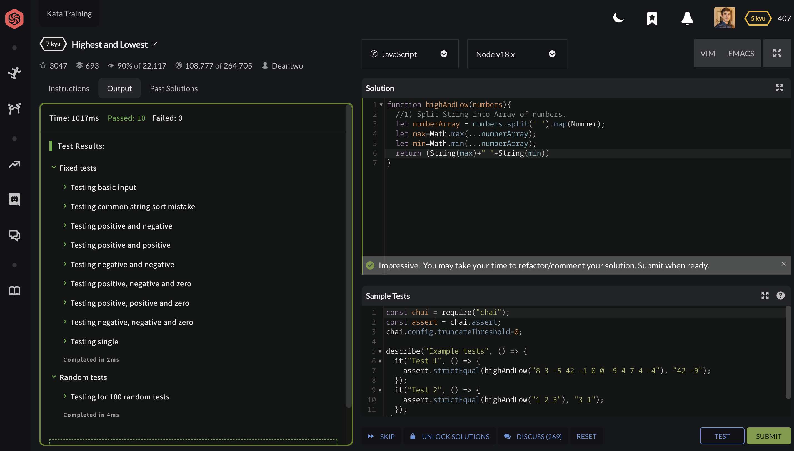

    ##JavaScript Homework 2

    
For the exercise 1, I looped through the key elements and printed them out.

    
For the exercise 2, I Created a class Person and gave it two attributes that
        could get passed in when creating a new object. I created a method to print and 
        a method to add one year to the initial age.
    

    
For the exercise 3, I created a promise based function two check if a string's length
        was greater than 10. I then made another promise based function with the same goal to 
        show a different approach to creating Promise Based functions.
    

    <h3>Codewar problem that I hadn't completed in python before:</h3>
    
     
     
    <h3>Codewar problem that I have completed in python before:</h3>
    
